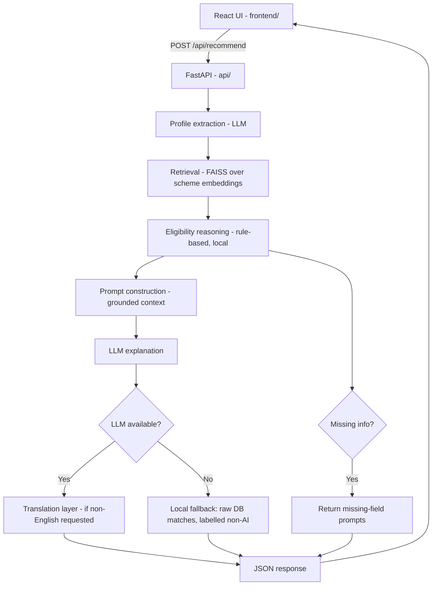

# SchemeSaathi AI

**"Government schemes, explained for you."**

**OOSC 4.0 Hackathon (IIIT Allahabad) — Problem Statement 5: AI for Public Good**

## Problem Statement

*Inclusive AI, Social Impact and Empowerment of Underserved Communities.*
Build an AI-powered solution addressing a real-world problem faced by
underserved communities in India, improving access to information,
decision-making, livelihoods, safety, or essential services -- while
accounting for local languages, digital literacy, affordability,
accessibility, and limited connectivity.

## Problem

India has 4,700+ central and state government schemes on myScheme alone,
but awareness is the real bottleneck, not scheme availability. Eligibility
criteria are written in dense bureaucratic language, spread across dozens
of separate government websites, and rarely explained in a way that's
accessible to the people they're meant for.

## Solution

SchemeSaathi lets a citizen describe their situation in plain
language -- English, Hindi, or a mix -- and returns which government
schemes they may be eligible for, why, what's still missing to be sure,
what documents are needed, and how to apply. Every recommendation links
to its official government source. See `docs/impact.md` for the full
problem/solution framing.

## Why AI?

Because the bottleneck is genuinely a language-and-reasoning problem, not
a data-availability one: the schemes already exist and are public. What's
missing is a way to match a person's plain-language situation against
formal eligibility text and explain the result honestly, in their own
language. A static search/filter UI (which myScheme already offers) still
requires the user to know the right categories and terms; SchemeSaathi
removes that requirement.

## Key Features

- **Natural-language + guided-profile input** -- describe your situation
  freely, or fill an optional short form.
- **Real RAG pipeline** -- FAISS vector search over a curated government
  scheme dataset, not a wrapper around a single LLM call.
- **Explainable eligibility matching** -- shows what matched, what's
  missing, and what didn't match, with an honest match level (never
  "100% eligible" or "approved") -- rendered as a hand-inked stamp, not a
  clean modern badge, on purpose (see "Design" below).
- **Missing-information detection** -- tells you what to add if your
  description isn't enough to narrow things down.
- **Source transparency** -- every recommendation links to its official
  government page.
- **English + Hindi support**, architected to extend to more Indian
  languages.
- **Graceful degradation** -- if the LLM is unavailable, you still get
  real database matches, clearly labelled as non-AI.
- **Compare Schemes** -- put 2-3 recommended schemes side by side in a
  modal table.
- **Responsible AI section** built into both the UI (collapsible sidebar
  panel) and this README.
- **React frontend + FastAPI backend** -- a real client/server split, not
  a Python-only demo script; fully responsive down to mobile.

## Design

The frontend deliberately does not use a generic SaaS look. The visual
language is drawn from the actual paperwork this product is about --
ledger books, passbooks, and stamped forms:

- **Palette**: deep ink-navy background (`#14213D`), warm ledger-paper
  cards (`#F1E9D8`), and muted stamp-pad accents (seal green, turmeric
  amber, brick red, fountain-pen teal) instead of a bright SaaS gradient.
- **Type**: Fraunces (display) for a characterful, slightly warm serif;
  IBM Plex Sans (body) and IBM Plex Mono (data/labels) for an
  institutional-but-human feel.
- **Signature element**: each scheme's match level renders as a rotated,
  hand-inked circular stamp reading "May Qualify" / "Partial Fit" /
  "Need Info" / "Low Fit" -- deliberately imperfect rather than a clean
  badge, because the product's core promise is that it never rubber-stamps
  official approval.
- **Layout**: a two-column "ledger" concept -- a sticky cover (settings,
  Responsible AI) beside the interaction itself as a paper "page,"
  collapsing to a single column on mobile.

## Architecture

See `docs/architecture.md` for the full reasoning behind each choice.



In production, `api/main.py` serves both the API and the built React app
from one process -- see "Frontend/backend split" in
`docs/architecture.md`.

## Tech Stack

| Layer | Choice |
|---|---|
| Frontend | React 18 + Vite, Tailwind CSS |
| Backend / API | FastAPI, served by Uvicorn |
| Embeddings | sentence-transformers (`paraphrase-multilingual-MiniLM-L12-v2`) |
| Vector search | FAISS (`IndexFlatIP`, local, persisted to disk) |
| LLM (default) | Google Gemini, via the current `google-genai` SDK |
| LLM (alternative) | OpenAI, swap via `LLM_PROVIDER=openai` in `.env` |
| Translation | `deep-translator` (free, no billing setup) |
| Eligibility reasoning | Rule-based Python heuristic (`src/eligibility.py`) |

## Dataset

`data/schemes.json` ships with **45 real, well-known central government
schemes**, spanning agriculture, rural development, women, youth, education,
MSME, street vendors, artisans, financial inclusion, social security,
housing, disability, fisheries/livelihoods, health, and energy -- directly
covering the problem statement's illustrative directions.

**Honest coverage note:** these 45 records are accurate at the level of
scheme name, issuing ministry, category, and general eligibility/benefit
shape, cross-checked against multiple sources during development. Exact
current eligibility figures, benefit amounts, and every individual source
URL were **not** independently re-verified against myscheme.gov.in for
every single record in the time available for Phase 1 -- do this before
relying on the numbers in a real deployment. `last_verified` is left
`null` throughout rather than stamped with a false verification date.
150-300 schemes was the target in the original spec; we chose a smaller,
honestly-labelled dataset over an inflated one padded with unverified or
fabricated entries. To scale up before final submission, pull from:

- Kaggle: https://www.kaggle.com/datasets/jainamgada45/indian-government-schemes
- Hugging Face: https://huggingface.co/datasets/shrijayan/gov_myscheme

Keep the same JSON shape and re-run `python src/ingest.py` after updating.

## Project Structure

```
SchemeSaathi-AI/
├── api/                     # FastAPI backend
│   ├── main.py              # app entrypoint: API routes + serves built frontend
│   ├── routes.py            # /health, /schemes, /compare, /recommend
│   └── schemas.py           # Pydantic request/response models
├── frontend/                # React (Vite) frontend
│   ├── index.html
│   ├── package.json
│   ├── vite.config.js       # dev-server proxy to FastAPI on :8000
│   ├── tailwind.config.js   # ledger/stamp design tokens
│   └── src/
│       ├── App.jsx
│       ├── main.jsx
│       ├── index.css
│       ├── api/client.js    # fetch wrapper for the backend
│       ├── hooks/useSchemeSaathi.js
│       └── components/      # Header, Sidebar, QueryForm, ResultsPanel,
│                             # SchemeCard, MatchStamp, CompareTray/Table, ...
├── data/
│   └── schemes.json         # 45-scheme dataset
├── storage/                 # generated FAISS index + metadata (gitignored)
├── src/                     # the RAG pipeline itself (framework-agnostic)
│   ├── config.py
│   ├── models.py
│   ├── ingest.py
│   ├── embeddings.py
│   ├── vector_store.py
│   ├── retriever.py
│   ├── eligibility.py
│   ├── prompt_engine.py
│   ├── llm.py
│   ├── recommender.py
│   ├── translator.py
│   └── utils.py
├── tests/
│   ├── test_data.py         # dataset validation (no network needed)
│   ├── test_eligibility.py  # eligibility heuristic (no network needed)
│   ├── test_api.py          # API smoke tests (needs `pip install`)
│   └── test_retriever.py    # retrieval quality (needs deps + built index)
├── docs/
│   ├── architecture.md
│   ├── demo_script.md
│   └── impact.md
├── scripts/
│   ├── setup.sh              # installs Python + Node deps, builds index
│   └── run.sh                 # runs FastAPI + Vite dev servers together
├── Dockerfile                 # multi-stage: builds frontend, serves via FastAPI
├── docker-compose.yml
├── Procfile
├── requirements.txt
├── .env.example
└── README.md
```

## Installation

```bash
git clone <your-repo-url>
cd SchemeSaathi-AI
bash scripts/setup.sh   # installs Python + Node deps, builds the index
```

Or manually:

```bash
# Backend
python -m venv venv
source venv/bin/activate      # Windows: venv\Scripts\activate
pip install -r requirements.txt
cp .env.example .env          # then edit .env and add your API key
python src/ingest.py          # build the vector index (run once)

# Frontend
cd frontend
npm install
cd ..
```

## Environment Variables

See `.env.example` for the full list. At minimum, set:

```
LLM_PROVIDER=gemini
GEMINI_API_KEY=your_key_here
GEMINI_MODEL=gemini-3.6-flash
```

**Note on model names:** Gemini model names move fast -- `gemini-2.5-flash`
was retired in favor of `gemini-3.6-flash` during this project's
development. If `/api/recommend` starts returning a "model not found"
style error, check https://ai.google.dev/gemini-api/docs/models for the
current model name and update `GEMINI_MODEL` in `.env`.

## Build Vector Index

```bash
python src/ingest.py
```

Re-run this any time `data/schemes.json` changes. The API never rebuilds
the index itself -- it only loads what's already on disk (and returns a
clear `503` from `/api/recommend` if it's missing).

## Run (development)

Runs the FastAPI backend (with reload) and the Vite dev server together,
with hot reload on both:

```bash
bash scripts/run.sh
```

Then open **http://localhost:5173**. Vite proxies `/api/*` requests to
FastAPI on port 8000 automatically (see `frontend/vite.config.js`), so
this behaves identically to production.

Or run them in two separate terminals:

```bash
# Terminal 1
uvicorn api.main:app --reload --port 8000

# Terminal 2
cd frontend && npm run dev
```

## Run (production-style, one process)

```bash
cd frontend && npm run build && cd ..
uvicorn api.main:app --host 0.0.0.0 --port 8000
```

Open **http://localhost:8000** -- FastAPI now serves the built React app
directly alongside the API, from one process.

## Testing

```bash
python -m unittest tests.test_data -v          # no network needed
python -m unittest tests.test_eligibility -v   # no network needed
python -m unittest tests.test_api -v           # needs `pip install -r requirements.txt`
python -m unittest tests.test_retriever -v     # needs deps + built index
```

`test_data.py` and `test_eligibility.py` were run and pass in the
environment this project was built in (14/14 assertions). `test_api.py`
and `test_retriever.py` need `fastapi`/`httpx` and
`sentence-transformers`/`faiss` respectively installed -- both skip
themselves cleanly with a clear message if those aren't available, rather
than failing confusingly. Run them yourself after `pip install` to
confirm.

**Frontend was not build-tested in the environment this project was
generated in** (no network access to the npm registry there) -- run
`npm install && npm run build` yourself and confirm it compiles cleanly
before submission. The JSX was written and reviewed carefully, but "I
wrote it carefully" is not the same claim as "I ran it," and this README
says so plainly rather than implying otherwise.

## Deployment

Because `api/main.py` serves the built frontend itself, this deploys as
**one web service**, not two.

### Docker

```bash
docker build -t schemesaathi .
docker run -p 8000:8000 --env-file .env schemesaathi
```

or:

```bash
docker compose up --build
```

The frontend is built and the vector index is generated at image-build
time, so the container is ready to serve as soon as it starts.

### Render / Railway / Fly.io (single Python web service)

1. Push this repo to GitHub (`node_modules/`, `frontend/dist/`,
   `storage/`, and `.env` are all gitignored, which is correct).
2. Create a new web service pointing at this repo, using the Dockerfile
   (all three platforms support Dockerfile-based deploys directly --
   no extra build configuration needed).
3. Set `GEMINI_API_KEY` (and `LLM_PROVIDER=gemini`) as environment
   variables / secrets in the platform's dashboard.
4. Deploy. The Docker build handles installing Node + Python
   dependencies, building the frontend, and generating the index.

## Responsible AI

- **No guaranteed eligibility.** The app never says a scheme is
  "approved" or that a person is "100% eligible" -- only the relevant
  government authority can confirm that. This is enforced both in the
  LLM prompt and structurally in `MatchLevel` (see
  `tests/test_eligibility.py::test_never_returns_absolute_certainty_language`),
  and visually in the frontend's intentionally-imperfect ink-stamp design.
- **Source transparency.** Every recommendation shows its official
  government source link.
- **Human/government verification.** The UI disclaimer explicitly tells
  users to verify with the relevant authority.
- **Privacy / no unnecessary personal information.** We only ask for
  state, occupation, approximate income bracket, and stated need -- never
  exact income figures, ID numbers, or anything the user didn't
  volunteer. All profile fields are optional.
- **Hallucination prevention.** The LLM is instructed to use only
  retrieved scheme data and never invent scheme names, benefits, or
  criteria; the eligibility engine is rule-based and auditable rather
  than left to model judgment.
- **AI-generated vs official information.** AI explanations are visually
  and textually distinct from the official source link and disclaimer
  block; the local fallback mode is explicitly labelled as non-AI.
- **Limitations.** See "Dataset" above for what's genuinely verified vs.
  not yet; see "Limited connectivity" in `docs/architecture.md` for what
  works offline vs. what needs the LLM API.

## Limitations

- Dataset covers 45 central schemes, not the full 150-300 target -- see
  the honest coverage note above.
- Eligibility matching is a heuristic over parseable criteria (occupation
  keywords, state, income signal, an age range if the text states one
  plainly, disability requirement, land ownership for agriculture). It
  is not a substitute for reading the scheme's actual eligibility page.
- Only English and Hindi are wired up as answer languages for Phase 1.
- The frontend was not build-tested (`npm install && npm run build`) in
  the sandboxed environment this project was generated in -- see
  "Testing" above.
- `test_retriever.py` and `test_api.py` require network access on first
  run (to download the embedding model / install dependencies) and were
  not executed in that same sandboxed environment -- run them yourself
  after setup to confirm.

## Future Scope

- **Bhashini integration** for more Indian languages, plus speech-to-text
  and text-to-speech for low-literacy users.
- **Voice input** end to end, building on the above.
- **More Indian languages** beyond English/Hindi (Bengali, Tamil, Telugu,
  Marathi, Gujarati, Kannada already scoped in `config.PLANNED_LANGUAGES`).
- **WhatsApp integration** as a last-mile front-end, calling
  `src/recommender.py` directly (or the `/api/recommend` endpoint).
- **State-specific scheme expansion** beyond the central-scheme dataset.
- **Offline/edge capabilities** for the retrieval layer specifically
  (already local-only; packaging for true offline use is the next step).
- **Government API integration** once/if a direct scheme-data API becomes
  available, instead of a periodically-refreshed dataset file.
- **Personalized alerts** for new schemes matching a saved profile.

## Social Impact

See `docs/impact.md`.

## Team

- <name> — RAG pipeline, retrieval, eligibility engine
- <name> — React frontend, FastAPI backend
- <name> — testing, documentation, deployment, demo video

## Demo Video

<link to be added — see docs/demo_script.md for the presentation script>
